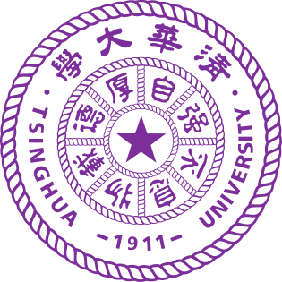

# Bio

I am a senior undergraduate at [Yao Class](https://iiis.tsinghua.edu.cn/en/yaoclass/), [Tsinghua University](https://www.tsinghua.edu.cn/en/), major in Computer Science and Technology. I am particularly interested in databases, systems, and data management. My goal is to develop a highly-efficient and -intelligent systems to make data management easier and more accurate. 

# Preprints

### Towards Accurate and Efficient Document Analytics with Large Language Models

Yiming Lin, Madelon Hulsebos, **Ruiying Ma**, Shreya Shankar, Sepanta Zeigham, Aditya G. Parameswaran, Eugene Wu

[paper](https://arxiv.org/abs/2405.04674)

# Education & Experiences

<!-- 

 -->

## Tsinghua University

***Bachelor of Engineering*, Institute for Interdisciplinary Information Sciences (Yao Class)**

***Research Assistant*, advised by Prof. Huanchen Zhang**

*Sep. 2021 - Present*

<!-- 

 -->

## University of California, Berkeley 

***Research Assistant*, advised by Prof. Aditya Parameswaran**

*Feb. 2024 - Aug. 2024*

<!-- 

 -->

## Microsoft Research Asia 

***Research Intern*, advised by Dr. Chieh-Jan Mike Liang**

*Aug. 2024 - Present*

<!-- Updated Dec 2024. -->
